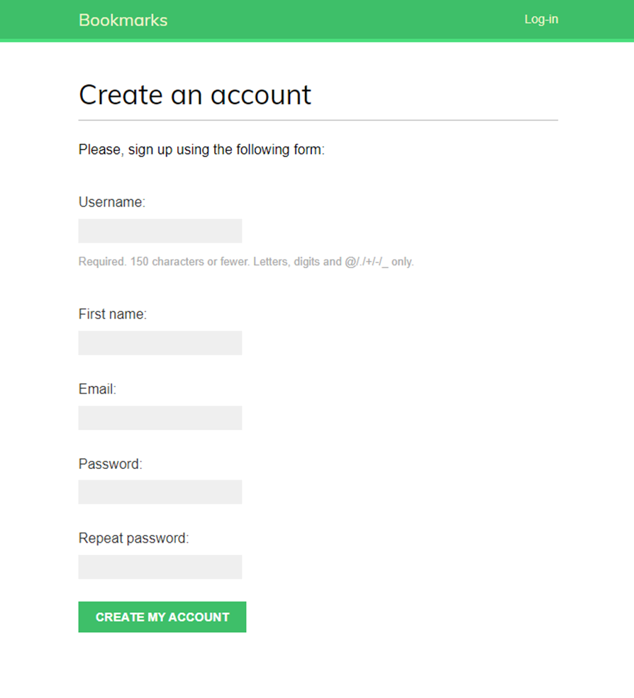
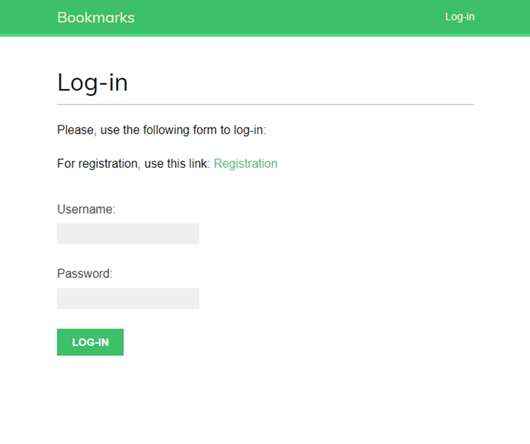
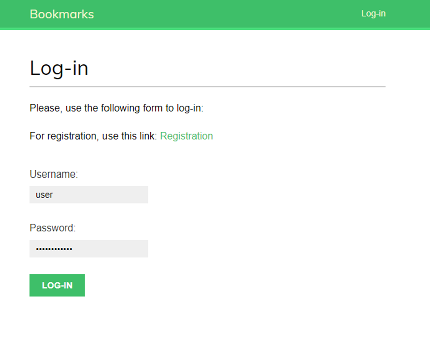
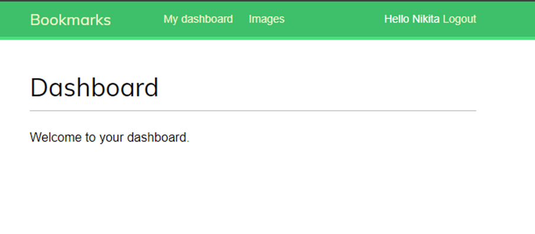
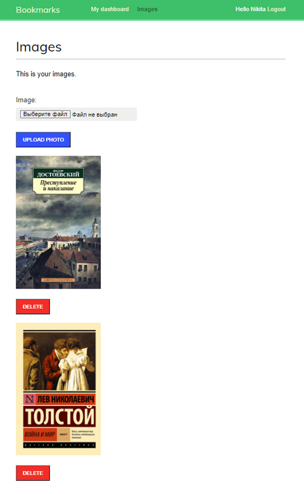

# Diffie-Hellman

## Описание программы

Данное веб-приложение позволяет проходить процесс регистрации, аутентификации, авторизации, загружать изображения на сайт. При этом, протокол Диффи-Хеллмана позволяет сделать процесс передачи всех данных защищённым, даже при условии того, что используется незащищённый от прослушивания канал связи (не `https`).

## Установка зависимостей

Находясь в папке проекта, выполните команду:

`pip install -r requirements.txt`

## Запуск программы

Перейдите в директорию проекта и выполните команду:

`python manage.py runserver`
---------
**ВАЖНО!**

**Отключите в настройках вашего Django встроенное хэширование данных при регистрации!**
---------

Адрес сервера: `http://127.0.0.1:8000/`

## Пример работы программы

